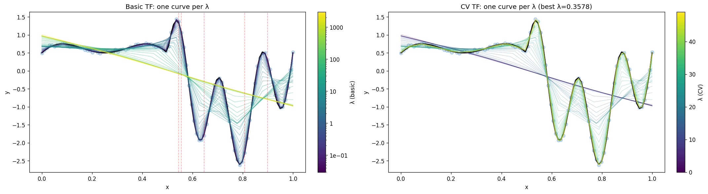

# trendfilter

[](https://opensource.org/licenses/MIT)
[](https://www.python.org/downloads/)

Python package for fast and flexible univariate trend filtering with C++ backend for high performance.

## Overview

Trend filtering is a method for nonparametric regression that fits a piecewise polynomial function to data. This package provides efficient implementations of trend filtering algorithms with the following features:

- **Fast C++ backend**: High-performance implementations using modern C++
- **Python interface**: Easy-to-use Python API built with pybind11
- **Flexible algorithms**: Support for different orders of trend filtering
- **Cross-validation**: Built-in cross-validation for parameter selection
- **Efficient solvers**: Optimized linear system solvers for large datasets

## Installation

### Pre-built Wheels (Recommended)

Pre-built wheels are available for major platforms:

- **Linux**: x86_64 (manylinux2014)
- **Windows**: x86_64 
- **macOS**: x86_64 and ARM64 (Apple Silicon)
- **Python**: 3.8, 3.9, 3.10, 3.11, 3.12

```bash
pip install trendfilter
```

*Note: If no wheel is available for your platform, pip will automatically fall back to building from source.*

### From source
```bash
git clone https://github.com/jiapivialiu/trendfilter-py.git
cd trendfilter-py
pip install .
```

**Requirements for source installation:**
- C++ compiler (GCC, Clang, or MSVC)
- Eigen3 development headers
- CMake (for some build configurations)

#### Platform-specific dependencies:
```bash
# Ubuntu/Debian
sudo apt-get install libeigen3-dev

# CentOS/RHEL
sudo yum install eigen3-devel

# macOS
brew install eigen

# Windows (with vcpkg)
vcpkg install eigen3:x64-windows
```

## Quick Start

```python
import numpy as np
import pandas as pd
import matplotlib.pyplot as plt
from trendfilter import TrendFilter, CVTrendFilter

# Generate sample data
n = 100
x = np.linspace(0, 1, n)
true_signal = np.sin(2 * np.pi * x) + 0.5 * np.cos(4 * np.pi * x)
y = true_signal + 0.2 * np.random.randn(n)

# Fit trend filter
tf = TrendFilter(order=2, lambda_reg=0.1)
tf.fit(y)
y_fit = tf.predict()

# Cross-validation for parameter selection
cv_tf = CVTrendFilter(order=2)
cv_tf.fit(y)
y_fit_cv = cv_tf.predict()
```

Check out the [README_plot](examples/generate_readme_plot.py) script or the [basic_usage](examples/basic_usage.py) for visualizing the output. Preview of the output as below:



## Features

### Core Algorithms
- **Trend Filtering**: Fast implementation of univariate trend filtering
- **Cross-Validation**: Automated parameter selection via cross-validation
- **Multiple Orders**: Support for different polynomial orders (0, 1, 2, ...)

### Performance
- **C++ Backend**: High-performance C++ implementations
- **Efficient Solvers**: Specialized linear system solvers
- **Memory Optimized**: Efficient memory usage for large datasets

## Requirements

- Python >= 3.7
- NumPy >= 1.18.0
- SciPy >= 1.5.0
